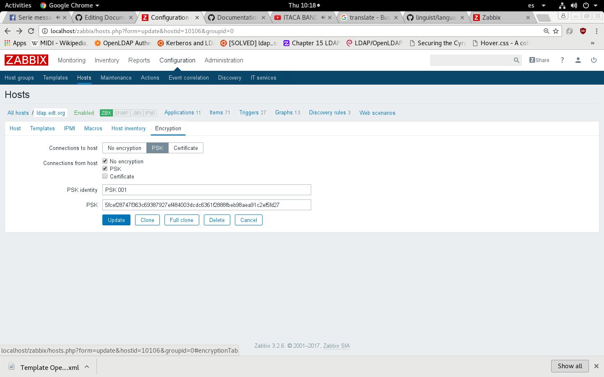
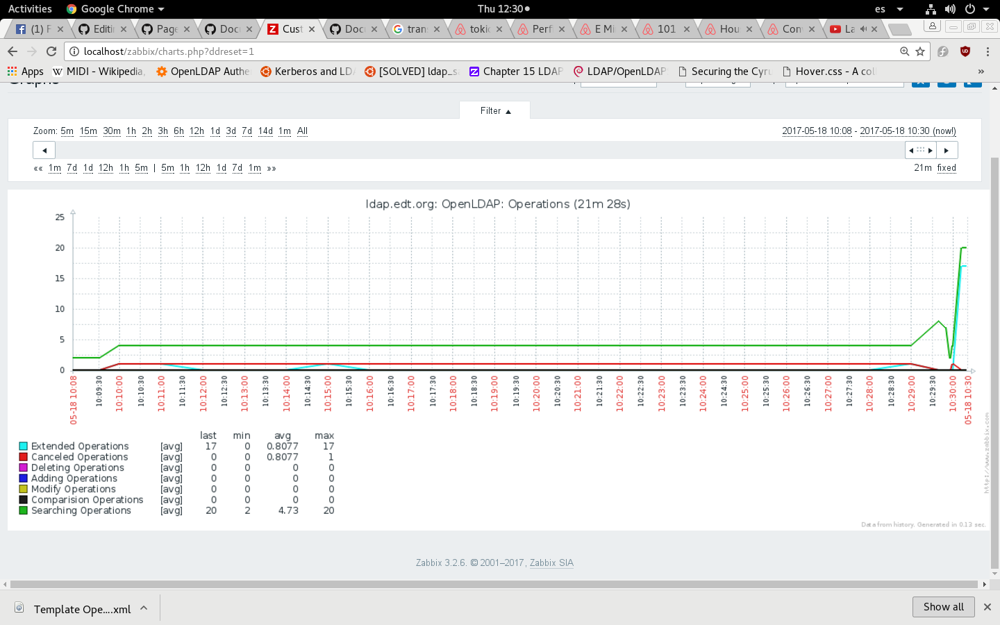

# Example fast 4 - Zabbix Monitoring to Monitor Database from Openldap Server

## Overview

Finally, in this model, we will see in a Zabbix server how to have monitored by graphs, all the operations that are done in our LDAP Server and all connections to it.

## Requisites

- Docker Engine working on the system
- Run this with user with permisions
- Dont having running Apache server 

Note:_This Script only tested in Fedora 24_

## How To Deploy

If you want to see how it works in your computer , follow this steps.

- Download the start script [start_example4.sh](../../raw/master/AutomatedScript/start_example4.sh)
- Run it `/bin/bash start_example4.sh`
- Wait to finish the installation

## Try it

We gonna enter into Zabbix Frontent [localhost/zabbix](http://localhost/zabbix)
Note:_User:admin password:zabbix_
        
You should enable _No Encryption_ option for recieve LDAP data, i dont know the reason why need to do this...
Choose the **host** and enable it.



Now its time to enter to _Client_ and perform some searches.

	docker exec --interactive --tty client bash

Obtain ticket of **user01**

	echo "kuser01" | kinit user01
	
And now realize some searches to LDAP

	ldapsearch -ZZ cn=user01
    

Now go again to see the graphs, it should be like this.




If you preffer long explanation , you have [How to configure Zabbix for Monitoring LDAP](https://github.com/antagme/Documentation_Project/blob/master/example4.md)

```INI
#!/bin/bash
# Author: Pedro Romero Aguado
# Date: 04/05/2017
# Script for Start Network and the Docker Containers Needed for Example
# If you want check the logs , its posible in $LOG_FILE variable

#SET LOG FILE
LOG_FILE="/dev/stdout"
#SET NETWORK NAME
DOCKER_NETWORK="ldap"
#SET CONTAINERS AND IMAGES NAMES
CONTAINER_LDAP="ldap"
CONTAINER_KERBEROS="kerberos"
CONTAINER_CLIENT="client"
CONTAINER_ZABBIX="zabbix"
IMAGE_LDAP="antagme/ldap_zabbix"
IMAGE_KERBEROS="antagme/kerberos:supervisord"
IMAGE_CLIENT="antagme/client_gssapi"
IMAGE_ZABBIX="antagme/httpd:zabbix"

#----------------------------------------------------------------------#

# Stop all containers with this names if this is running
echo " STOPING CONTAINERS"
docker stop $CONTAINER_LDAP &> $LOG_FILE
docker stop $CONTAINER_KERBEROS &>> $LOG_FILE
docker stop $CONTAINER_CLIENT &>> $LOG_FILE
docker stop $CONTAINER_ZABBIX &>> $LOG_FILE

# Remove all containers with this names
echo " REMOVING CONTAINERS"
docker rm $CONTAINER_LDAP  &>> $LOG_FILE
docker rm $CONTAINER_KERBEROS  &>> $LOG_FILE
docker rm $CONTAINER_CLIENT  &>> $LOG_FILE
docker rm $CONTAINER_ZABBIX &>> $LOG_FILE

# Remove Images of all Containers?
echo " REMOVING IMAGES"
#docker rmi $IMAGE_LDAP  &>> $LOG_FILE
#docker rmi $IMAGE_KERBEROS  &>> $LOG_FILE
#docker rmi $IMAGE_CLIENT  &>> $LOG_FILE
#docker rmi $IMAGE_ZABBIX  &>> $LOG_FILE

#REMOVE IF EXISTS 
echo " Deleting Network"
docker network rm $DOCKER_NETWORK &>> $LOG_FILE

#CREATE NETWORK
echo " Creating Network"
docker network create --subnet 172.18.0.0/16 --driver bridge \
	$DOCKER_NETWORK &>> $LOG_FILE \
	&& echo " Docker Network $DOCKER_NETWORK Created"

# Run Containers
## Docker LDAP
echo " RUNNING CONTAINERS IT CAN TAKE A WHILE...WAIT PLEASE!!!"

docker run --name $CONTAINER_LDAP \
	--hostname ldap.edt.org --net $DOCKER_NETWORK \
	--ip 172.18.0.2  --detach $IMAGE_LDAP &>> $LOG_FILE \
	&& echo " Ldap Container Created... %25 Completed"

## Docker Kerberos

docker run --name $CONTAINER_KERBEROS \
	--hostname kserver.edt.org --net $DOCKER_NETWORK \
	--ip 172.18.0.3  --detach  $IMAGE_KERBEROS &>> $LOG_FILE \
	&& echo " Kerberos Container Created ... %50 Completed"
	
## Docker Client
docker run --name $CONTAINER_CLIENT \
	--hostname client.edt.org --net $DOCKER_NETWORK \
	--ip 172.18.0.8  --detach  $IMAGE_CLIENT &>> $LOG_FILE \
	&& echo " Client Container Created ... %75 Completed"

## Docker Zabbix

docker run --name $CONTAINER_ZABBIX \
	--hostname zabbix.edt.org --net $DOCKER_NETWORK \
	--ip 172.18.0.10 --publish=80:80 --detach $IMAGE_ZABBIX \
	 &>> $LOG_FILE \
	&& echo " Zabbix Container Created ... %100 Completed"

echo -e " Thanks For the Wait"'!!!'" \n For Access inside Container \
	\n docker exec --interactive --tty [Container Name] bash "
```
